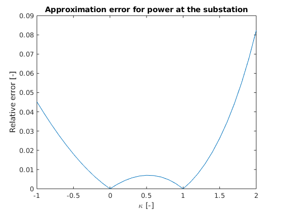

.. This rst was auto-generated from MATLAB code.
.. To make changes, update the MATLAB code and republish this document.

Replicate the paper's results to verify correctness
---------------------------------------------------------------------------------------------------
This file replicates the results in Figures 3 and 5 of :cite:`Bernstein2017`.

*Generated from aaReplicatePaperResults.m*    
    

.. code-block:: matlab

	clear variables
	aaSetupPath

Initialize OPF problem with PowerFlowSurrogate_Bernstein2017_LP
^^^^^^^^^^^^^^^^^^^^^^^^^^^^^^^^^^^^^^^^^^^^^^^^^^^^^^^^^^^^^^^^^^^^^^^^^^^^^^^^^^^^^^^^^^^^^^^^^^^

.. code-block:: matlab

	[opf_spec, load_case] = CreateSampleOPFspec();
	
	% Replace pf_surrogate_spec with PowerFlowSurrogateSpec_Bernstein2017_LP_2
	opf_spec.pf_surrogate_spec = PowerFlowSurrogateSpec_Bernstein2017_LP_2();
	
	opf_problem = uot.OPFproblem(opf_spec,load_case);

Solve approximate power flow to see if everything is working
^^^^^^^^^^^^^^^^^^^^^^^^^^^^^^^^^^^^^^^^^^^^^^^^^^^^^^^^^^^^^^^^^^^^^^^^^^^^^^^^^^^^^^^^^^^^^^^^^^^

.. code-block:: matlab

	linearization_point = uot.enum.CommonLinearizationPoints.FlatVoltage;
	
	u_pcc_array = opf_problem.u_pcc_array;
	t_pcc_array = opf_problem.t_pcc_array;
	
	[U_ast,T_ast] = linearization_point.GetVoltageAtLinearizationPoint(load_case,u_pcc_array,t_pcc_array);
	[U_array,T_array, p_pcc_array, q_pcc_array,extra_data] = PowerFlowSurrogate_Bernstein2017_LP_2.SolveApproxPowerFlowAlt(load_case,u_pcc_array,t_pcc_array,U_ast,T_ast);

Set-up for continuation analysis
^^^^^^^^^^^^^^^^^^^^^^^^^^^^^^^^^^^^^^^^^^^^^^^^^^^^^^^^^^^^^^^^^^^^^^^^^^^^^^^^^^^^^^^^^^^^^^^^^^^
Now, we will try to replicate the paper's results. In the continuation analysis, the authors used a range of factors kappa \in [-1,2]

.. code-block:: matlab

	kappa_vec = -1:0.1:2;
	
	% We reorder kappa_vec so that 1 is the first element.
	% The reason for this is explained below.
	kappa_vec = [kappa_vec(kappa_vec == 1), kappa_vec(kappa_vec ~= 1)];
	
	% Then we use kappa_vec to create a load_case which is scaled
	% according to kappa_vec. This works because load_case contains loads for
	% a single time-step (as in the IEEE specification).
	load_case_continuation = load_case.*kappa_vec;
	
	% The result is a load case with loads for n_time_step
	% time steps. Here, they do not represent actual time steps, but rather
	% the different loads for our continuation analysis. We take advantage
	% of the capability of representing time-varying loads to make the code
	% more concise.
	n_time_step = load_case_continuation.n_time_step

.. code-block:: console  

	
	n_time_step =
	
	    31
	

Choose a linearization point
^^^^^^^^^^^^^^^^^^^^^^^^^^^^^^^^^^^^^^^^^^^^^^^^^^^^^^^^^^^^^^^^^^^^^^^^^^^^^^^^^^^^^^^^^^^^^^^^^^^
Now we need to choose a linearization point for solving the approximate power flow. One common choice is the power flow solution at the first time of the base case. Here, the base case should be understood in the context of OPF problems: the case in the absence of controllable loads. However, since we are not working with controllable loads yet, this is simply the first time step of the load case. Here, it should become clear why we reordered kappa_vec above so that 1 is the first element: so that we use it as our linearization point.

.. code-block:: matlab

	linearization_point_continuation = uot.enum.CommonLinearizationPoints.PFbaseCaseFirstTimeStep;

Solve approximate power flow using the linear formulation
^^^^^^^^^^^^^^^^^^^^^^^^^^^^^^^^^^^^^^^^^^^^^^^^^^^^^^^^^^^^^^^^^^^^^^^^^^^^^^^^^^^^^^^^^^^^^^^^^^^
Extend u_pcc_array and t_pcc_array to have one entry per time step

.. code-block:: matlab

	u_pcc_array_continuation = repmat(u_pcc_array,n_time_step,1);
	t_pcc_array_continuation = repmat(t_pcc_array,n_time_step,1);
	
	[U_ast_continuation,T_ast_continuation] = linearization_point_continuation.GetVoltageAtLinearizationPoint(load_case_continuation,u_pcc_array_continuation,t_pcc_array_continuation);
	[U_array_continuation,T_array_continuation, p_pcc_array_continuation, q_pcc_array_continuation,extra_data_continuation] = PowerFlowSurrogate_Bernstein2017_LP_2.SolveApproxPowerFlowAlt(load_case_continuation,u_pcc_array_continuation,t_pcc_array_continuation,U_ast_continuation,T_ast_continuation);
	
	V_array_continuation = uot.PolarToComplex(U_array_continuation,T_array_continuation);
	s_pcc_continuation = p_pcc_array_continuation + 1i*q_pcc_array_continuation;

Get reference values from solving exact power flow
^^^^^^^^^^^^^^^^^^^^^^^^^^^^^^^^^^^^^^^^^^^^^^^^^^^^^^^^^^^^^^^^^^^^^^^^^^^^^^^^^^^^^^^^^^^^^^^^^^^

.. code-block:: matlab

	[U_array_ref,T_array_ref, p_pcc_array_ref, q_pcc_array_ref] = load_case_continuation.SolvePowerFlow(u_pcc_array_continuation,t_pcc_array_continuation);
	
	V_array_ref = uot.PolarToComplex(U_array_ref,T_array_ref);
	s_pcc_ref = p_pcc_array_ref + 1i*q_pcc_array_ref;

Compute error
^^^^^^^^^^^^^^^^^^^^^^^^^^^^^^^^^^^^^^^^^^^^^^^^^^^^^^^^^^^^^^^^^^^^^^^^^^^^^^^^^^^^^^^^^^^^^^^^^^^

.. code-block:: matlab

	v_error = zeros(n_time_step,1);
	u_error_eq9 = zeros(n_time_step,1);
	u_error_eq12 = zeros(n_time_step,1);
	s_pcc_error_pre = zeros(n_time_step,1);
	
	network = load_case_continuation.network;
	
	for i = 1:n_time_step
	    % Stack to get a vector without nans
	    V_continuation_stack = uot.StackPhaseConsistent(V_array_continuation(:,:,i),network.bus_has_phase);
	    V_ref_stack = uot.StackPhaseConsistent(V_array_ref(:,:,i),network.bus_has_phase);
	
	    U_continuation_eq9_stack = uot.StackPhaseConsistent(extra_data_continuation.U_array_eq9(:,:,i),network.bus_has_phase);
	    U_continuation_eq12_stack = uot.StackPhaseConsistent(extra_data_continuation.U_array_eq12(:,:,i),network.bus_has_phase);
	
	    U_ref_stack = uot.StackPhaseConsistent(U_array_ref(:,:,i),network.bus_has_phase);
	
	    v_error(i) = norm(V_continuation_stack - V_ref_stack,2)/norm(V_ref_stack,2);
	    u_error_eq9(i) = norm(U_continuation_eq9_stack - U_ref_stack,2)/norm(U_ref_stack,2);
	    u_error_eq12(i) = norm(U_continuation_eq12_stack - U_ref_stack,2)/norm(U_ref_stack,2);
	
	    s_pcc_error_pre(i) = norm(s_pcc_continuation(i,:) - s_pcc_ref(i,:));
	end
	
	% Compute apparent power by summing across phases and taking absolute value.
	s_pcc_mag_ref = abs(sum(s_pcc_ref,2));
	
	s_pcc_error = s_pcc_error_pre/max(s_pcc_mag_ref);

Create plots
^^^^^^^^^^^^^^^^^^^^^^^^^^^^^^^^^^^^^^^^^^^^^^^^^^^^^^^^^^^^^^^^^^^^^^^^^^^^^^^^^^^^^^^^^^^^^^^^^^^
Sort kappa_vec to get a nice plot

.. code-block:: matlab

	[kappa_vec_sorted,kappa_vec_sorted_ind] = sort(kappa_vec);
	
	v_error_sorted = v_error(kappa_vec_sorted_ind);
	u_error_eq9_sorted = u_error_eq9(kappa_vec_sorted_ind);
	u_error_eq12_sorted = u_error_eq12(kappa_vec_sorted_ind);
	
	s_pcc_error_sorted = s_pcc_error(kappa_vec_sorted_ind);
	
	% Compute error in voltage approximation
	figure
	hold on
	plot(kappa_vec_sorted,v_error_sorted);
	plot(kappa_vec_sorted,u_error_eq9_sorted);
	plot(kappa_vec_sorted,u_error_eq12_sorted);
	legend('Phasors','Magnitudes (eq. 9)','Magnitudes (eq. 12)')
	title('Approximation error for voltages')
	xlabel('\kappa [-]')
	ylabel('Relative error [-]')
	
	% Compute error in PCC power
	figure
	plot(kappa_vec_sorted,s_pcc_error_sorted);
	title('Approximation error for power at the substation')
	xlabel('\kappa [-]')
	ylabel('Relative error [-]')

